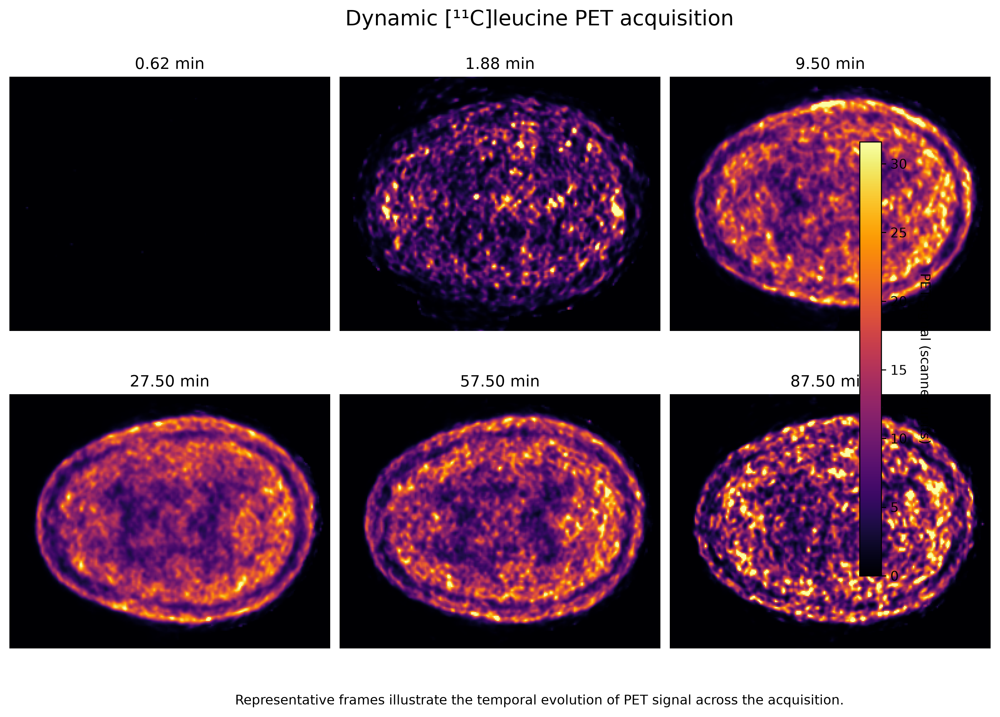

# Sleep, cerebral protein synthesis, and visual memory consolidation

An independent Python neuroimaging reanalysis of OpenNeuro **ds004731 v1.0.0** using L-[1-¹¹C]leucine PET-derived rates of cerebral protein synthesis (rCPS).

## Primary question

Does cerebral protein synthesis show a molecular pattern consistent with **sleep-dependent consolidation of a trained visual representation**?

The notebook tests three linked questions:

1. Does global cortical rCPS differ between sleep and wake groups?
2. Is rCPS higher in V1 contralateral to the trained visual field than in untrained V1?
3. Is the trained–untrained V1 difference larger in the sleep condition or associated with sleep architecture?

A whole-cortex Destrieux analysis complements these targeted tests.

## Main results

- 35 participants: 18 Asleep, 17 Awake.
- 5,180 hemisphere-specific cortical measurements; 5,062 (97.7%) passed ≥80% coverage QC.
- Global cortical rCPS: no detectable Asleep–Awake difference (Welch p = 0.735; d = 0.114).
- No cortical parcel survived FDR correction for the sleep/wake comparison.
- The apparent predominance of Asleep > Awake parcels was not supported by participant-label permutation (p = 0.765).
- Trained vs untrained V1: 2.4971 vs 2.4912 nmol/g/min; paired p = 0.739, dz = 0.057.
- Sleep modulation of the trained–untrained V1 contrast: p = 0.558, d ≈ 0.20.
- Within sleepers, no sleep stage (N1, N2, N3 or REM) showed a detectable association with the trained–untrained V1 contrast after FDR correction. N3, the principal continuous sleep-stage measure, was also not associated with the V1 contrast (Pearson r = 0.121, p = 0.633; Spearman ρ = −0.068, p = 0.788). REM inference was limited because only 5/18 sleepers had non-zero REM during the measured interval.
These are **null molecular/neuroimaging results**, not evidence that memory consolidation did not occur. Behavioural memory performance is not modelled directly here.

## Computational workflow

The project demonstrates Python-based dynamic PET visualisation, NIfTI handling, FreeSurfer/fsaverage surface processing, atlas compatibility validation, Destrieux parcellation, coverage QC, cohort aggregation, effect sizes, FDR correction, participant-level permutation testing, and hypothesis-driven V1 analysis.

### Dynamic PET inspection



## Repository layout

```
PET_memory_consolidation.ipynb
annotations/
data/
figures/
results/
requirements.txt
.gitignore
```

## Data

The imaging data are not redistributed in this repository. Obtain **OpenNeuro ds004731 v1.0.0** from OpenNeuro and place the required derivatives under `data/`.

For the targeted V1 analysis, place these FreeSurfer V1 ex-vivo labels under `annotations/`:

- `lh.V1_exvivo.thresh.label`
- `rh.V1_exvivo.thresh.label`

Create `data/memory_consolidation_metadata.csv` from the dataset session metadata with at least:

```
participant,trained_visual_field,stage_3
```

Optional sleep-stage columns used for extensions include `percent_awake`, `stage_1`, `stage_2`, and `rem`.

## Reproducibility note

Large PET files are intentionally excluded from Git. The notebook preserves the validated outputs from the original analysis and contains the code required to regenerate the targeted V1 statistics once the dataset and labels are placed in the expected directories.

## Scope

This is an exploratory portfolio reanalysis. Memory consolidation is the biological motivation, but behavioural performance is not analysed directly; conclusions are therefore limited to PET-derived rCPS signatures relevant to consolidation.
